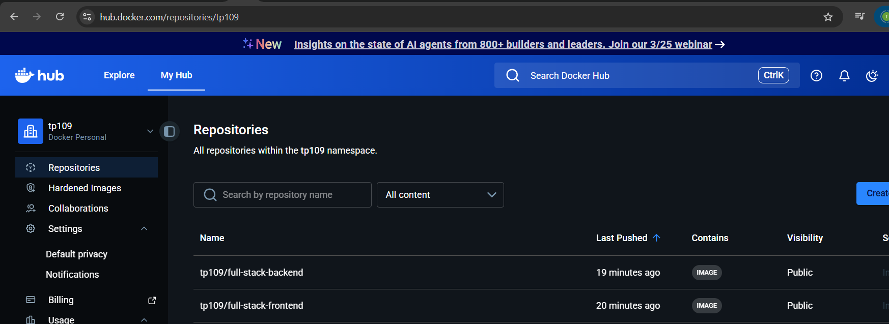
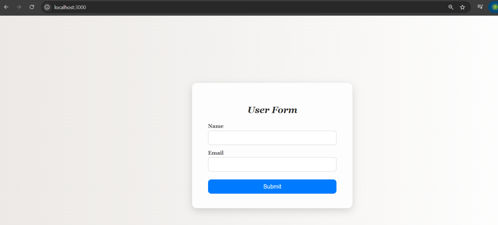
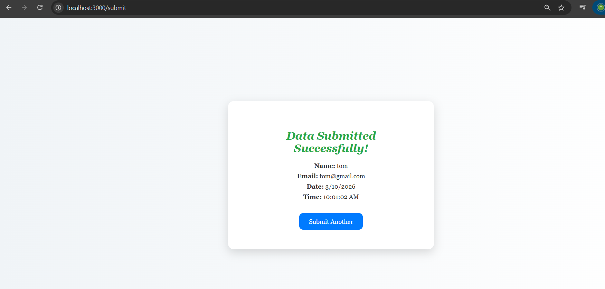
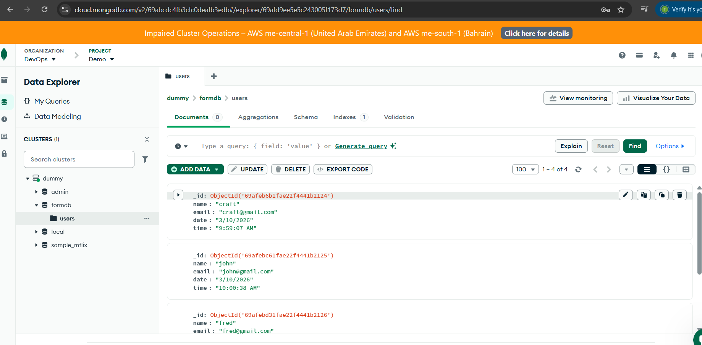

# Full-Stack Form App

This project is a **Full-Stack Form Application** with:

- **Frontend:** Node.js + Express + EJS  
- **Backend:** Flask (Python) + MongoDB Atlas  
- **Styling:** Classic UI for form and success page  
- **Dockerized:** Separate containers for frontend and backend  

The form automatically adds **date and time when submitted** and stores it in **MongoDB**.


# Project Structure

```
Full-Stack-Form-App/
│
├── base-image/
│   ├── backend/
│   │   ├── app.py            # Flask backend
│   │   └── Dockerfile
│   │
│   ├── frontend/
│   │   ├── server.js         # Node.js + Express frontend
│   │   ├── views/
│   │   │   ├── form.ejs
│   │   │   └── success.ejs
│   │   └── Dockerfile
│
├── 01-docker-compose-deployment/
│   ├── docker-compose.yml
│   ├── README.md
│   └── screenshots/
│       ├── Screenshot 2026-03-10 153201.png
│       ├── Screenshot 2026-03-10 153216.png
│       ├── Screenshot 2026-03-10 153228.png
│       └── image.png
│
└── .gitignore                
```

---

# Prerequisites

- Docker & Docker Compose
- Node.js (for local dev)
- Python + Flask (for local dev)
- MongoDB Atlas account
- GitHub account (for code repo)
- Docker Hub account (tp109)

---

# Setup & Run Locally

## Clone the repository

```bash
git clone https://github.com/tribhuwanpandey/Full-Stack-Form-App.git
cd ~/Full-Stack-Form-App/01-docker-compose-deployment
```

## Create `.gitignore`

```
node_modules/
.vscode/
.env
__pycache__/
*.pyc
.DS_Store
```

## Install frontend dependencies

```bash
cd ../base-image/frontend
npm install
cd ../../01-docker-compose-deployment
```

## Run backend locally

```bash
cd ../base-image/backend
python3 -m venv venv
source venv/bin/activate
pip install -r requirements.txt
python3 app.py
cd ../../01-docker-compose-deployment
```

## Run frontend locally

```bash
cd ../base-image/frontend
node server.js
cd ../../01-docker-compose-deployment
```

Open:

```
http://localhost:3000
```

Submit the form → check the success page → data stored in **MongoDB Atlas**.

---

# Docker Setup

## Build Docker Images

```bash
docker build -t tp109/full-stack-frontend ../base-image/frontend
docker build -t tp109/full-stack-backend ../base-image/backend
```

## Run using Docker Compose

```bash
docker-compose up --build
```

Frontend:

```
http://localhost:3000
```

Backend API:

```
http://localhost:5000/submit
```

---

# Docker Hub Images

Frontend: `tp109/full-stack-frontend`  
Backend: `tp109/full-stack-backend`



## Push Images to Docker Hub

```bash
docker login
docker push tp109/full-stack-frontend
docker push tp109/full-stack-backend
```

Images are publicly available for deployment anywhere.

---

# Features

- Classic styled form and success page
- Auto date & time on submission
- MongoDB Atlas integration
- Dockerized frontend & backend

---

# Screenshots

**Form Page:** Classic layout with input fields



**Success Page:** Shows name, email, date, and time



**MongoDB Atlas:** Data stored with timestamp

