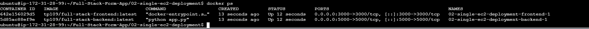
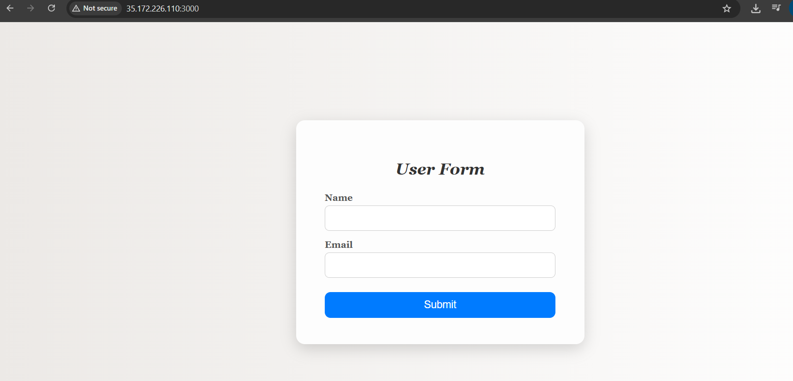
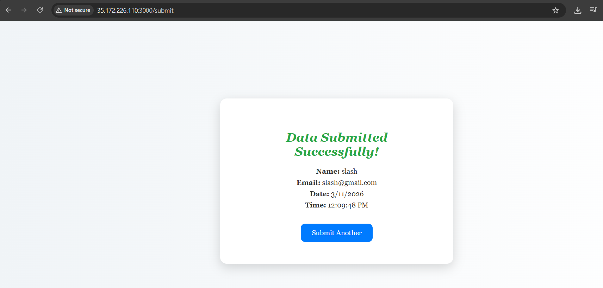

# 02 — Deploy on a Single EC2 Instance

> Both **Flask backend** and **Express frontend** run as Docker containers on **one EC2 instance** using Docker Compose.

---

##  Architecture

```
User (Browser)
      │
      ▼
35.172.226.110: 3000
┌──────────────────────────────────────────┐
│               EC2 Instance               │
│                                          │
│   ┌──────────────────────┐               │
│   │  Express Frontend    │  ← port 3000  │
│   │  (Node.js container) │               │
│   └──────────┬───────────┘               │
│              │  http://backend:5000       │
│              ▼                            │
│   ┌──────────────────────┐               │
│   │  Flask Backend       │  ← port 5000  │
│   │  (Python container)  │               │
│   └──────────────────────┘               │
│                                          │
│   [Docker Network: app-network]          │
└──────────────────────────────────────────┘
```

---

##  Folder Contents

```
02-single-ec2-deployment/
├── README.md               ← You are here
└── docker-compose.yaml     ← Used on EC2 to run both containers
```

> The actual application code lives in `/base-image/frontend` and `/base-image/backend`.
> Docker images are pulled from Docker Hub — no build happens on EC2.

---

##  Prerequisites

- AWS account (free tier works)
- Docker Hub images already pushed:
  - `tp109/full-stack-frontend:latest`
  - `tp109/full-stack-backend:latest`
- SSH client on local machine (Terminal / Git Bash / PuTTY)

---

##  Step-by-Step Deployment

### Step 1 — Launch EC2 Instance

1. **AWS Console → EC2 → Launch Instance**
2. Fill in settings:

   | Setting       | Value                                         |
   |---------------|-----------------------------------------------|
   | Name          | `fullstack-form-app`                          |
   | AMI           | Ubuntu Server 22.04 LTS (Free Tier Eligible)  |
   | Instance Type | `t2.micro` (1 vCPU, 1 GB RAM)                 |
   | Key Pair      | Create new → `form-app-key` → Download `.pem` |
   | Storage       | 8 GB gp2 (default)                            |

3. **Security Group — Inbound Rules:**

   | Type       | Port | Source      | Purpose                   |
   |------------|------|-------------|---------------------------|
   | SSH        | 22   | My IP       | Terminal access to EC2    |
   | Custom TCP | 3000 | 0.0.0.0/0   | Express frontend (public) |
   | Custom TCP | 5000 | 0.0.0.0/0   | Flask backend (for testing) |

4. Click **Launch Instance** and wait ~2 minutes

---

### Step 2 — SSH Into EC2

```bash
# Run on your LOCAL machine
cd ~/Downloads
chmod 400 form-app-key.pem

# Replace YOUR_EC2_PUBLIC_IP with actual IP from AWS Console
ssh -i form-app-key.pem ubuntu@YOUR_EC2_PUBLIC_IP
```

---

### Step 3 — Install Docker & Docker Compose

```bash
# Update system
sudo apt-get update -y && sudo apt-get upgrade -y

# Install Docker
sudo apt-get install -y docker.io
sudo systemctl start docker
sudo systemctl enable docker
sudo usermod -aG docker ubuntu
newgrp docker

# Install Docker Compose
sudo curl -L "https://github.com/docker/compose/releases/latest/download/docker-compose-$(uname -s)-$(uname -m)" \
  -o /usr/local/bin/docker-compose
sudo chmod +x /usr/local/bin/docker-compose

# Verify
docker --version
docker-compose --version

```

---

### Step 4 — Clone the Repository

```bash
git clone https://github.com/tribhuwanpandey/Full-Stack-Form-App.git
cd Full-Stack-Form-App/02-single-ec2-deployment
```

---

### Step 5 — Start Both Services

```bash
# Pull latest images from Docker Hub
docker-compose pull


# Start in detached mode (background)
docker-compose up -d

# Verify both containers are running
docker-compose ps



```

**Expected output:**
```
NAME                STATUS    PORTS
flask-backend       Up        0.0.0.0:5000->5000/tcp
express-frontend    Up        0.0.0.0:3000->3000/tcp
```

---

### Step 6 — Test

Open in browser:
```
http://35.172.226.110:3000    ← Express frontend form



http://35.172.226.110:5000    ← Flask backend direct



```

---

## Useful Commands

```bash
docker-compose ps                        # list container status
docker-compose logs -f                   # live logs (all services)
docker-compose logs -f frontend          # logs for frontend only
docker-compose logs -f backend           # logs for backend only
docker-compose down                      # stop and remove containers
docker-compose restart                   # restart all containers
docker-compose pull && docker-compose up -d   # pull latest & restart
```

---
